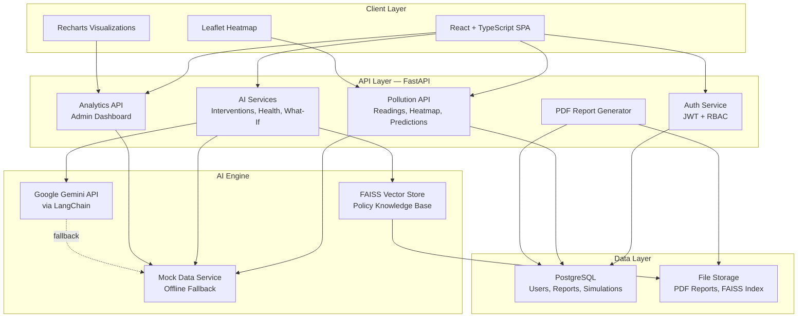

# AirGuardian AI — System Architecture

## Overview

AirGuardian AI is a full-stack urban air pollution intelligence platform that helps city administrators predict, analyze, and reduce air pollution through AI-powered decision support.

## Architecture Diagram



## Component Details

### Frontend (React + TypeScript + Tailwind)

| Module | Purpose |
|--------|---------|
| `pages/DashboardPage` | City-wide AQI overview with live heatmap |
| `pages/HeatmapPage` | Full-screen interactive pollution heatmap |
| `pages/PredictionsPage` | 6/12/24/72-hour AQI forecasts |
| `pages/AttributionPage` | Pollution source breakdown with confidence |
| `pages/InterventionsPage` | AI-generated government action plans |
| `pages/HealthPage` | Personalized citizen health advice |
| `pages/SimulatorPage` | What-if intervention scenario testing |
| `pages/ReportsPage` | AI-generated PDF report downloads |
| `pages/AnalyticsPage` | Admin analytics dashboard |

### Backend (FastAPI + Python)

| Service | Responsibility |
|---------|---------------|
| `auth` | JWT authentication, role-based access (admin/analyst/citizen) |
| `pollution` | AQI readings, heatmap data, predictions, source attribution |
| `ai_service` | LangChain + Gemini for interventions, health advice, simulations |
| `pdf_service` | ReportLab PDF generation |
| `mock_data` | Realistic Delhi NCR mock data when live APIs unavailable |
| `prediction_service` | AQI forecasting (mock ML with diurnal patterns) |
| `attribution_service` | Source attribution with zone-specific profiles |

### Data Flow

1. **Sensor Data** → Mock service generates realistic zone readings with time-of-day variation
2. **Predictions** → ML model applies diurnal cycles and trend factors for 6/12/24/72h forecasts
3. **AI Planning** → LangChain retrieves relevant policies from FAISS, Gemini generates action plans
4. **What-If** → Combines intervention reduction models with diminishing returns
5. **Reports** → Compiles readings, predictions, attribution into PDF via ReportLab

### Authentication & Authorization

```
admin@airguardian.gov    → Full access (analytics, reports, all features)
analyst@airguardian.gov  → Analytics + reports + all citizen features
citizen@example.com      → Dashboard, health assistant, predictions (read-only planning)
```

### Deployment

```
docker-compose up --build
```

- Frontend: http://localhost:3000
- Backend API: http://localhost:8000
- API Docs: http://localhost:8000/docs
- PostgreSQL: localhost:5432

## Technology Choices

| Technology | Why |
|-----------|-----|
| FastAPI | Async Python, auto OpenAPI docs, Pydantic validation |
| PostgreSQL | Reliable relational storage for users, reports, simulations |
| React + Vite | Fast dev experience, component-based UI |
| Tailwind CSS | Utility-first styling, responsive design |
| Leaflet + heat | Open-source maps with pollution heat overlay |
| Recharts | Composable React chart library |
| LangChain + Gemini | Structured AI prompts with RAG over policy documents |
| FAISS | Efficient similarity search for policy knowledge base |
| ReportLab | Server-side PDF generation |
| Docker Compose | One-command deployment of full stack |
